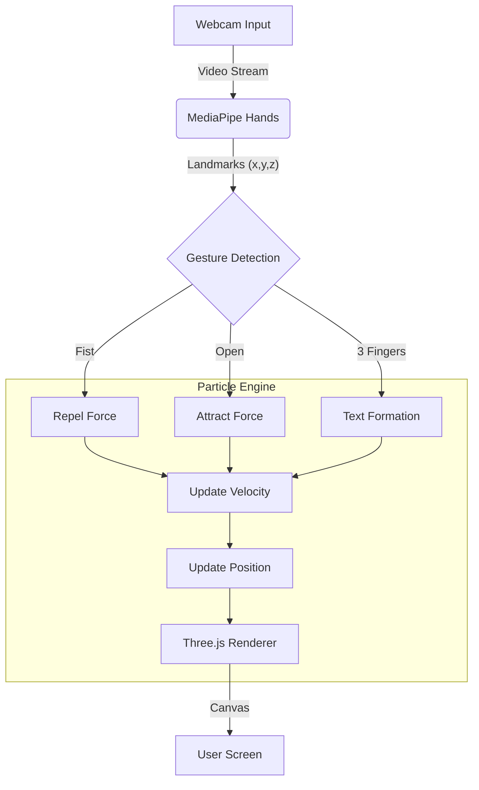
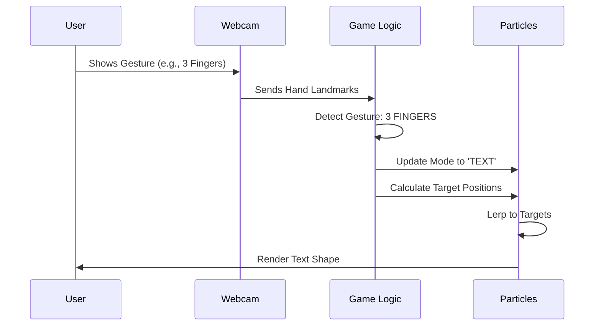
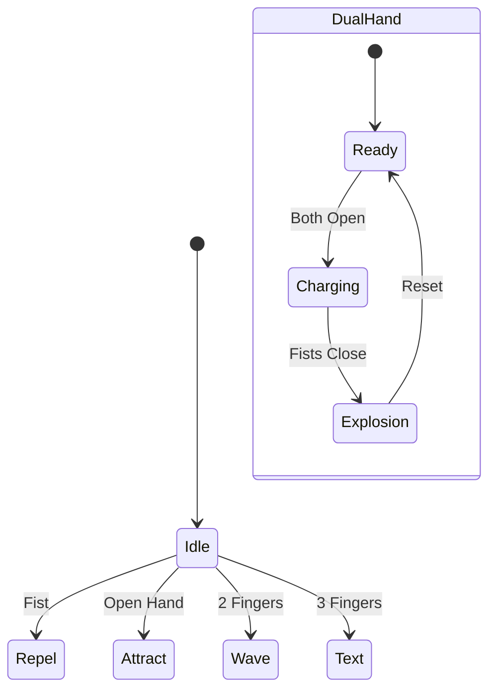

# 🪐 Real-Time Hand Gestures Particle System


A mesmerizing, interactive particle system controlled by real-time hand gestures. Built with **Three.js** for 3D rendering and **MediaPipe** for hand tracking.

## 🌟 Features

*   **Real-time Hand Tracking**: Detects hands and fingers instantly.
*   **Interactive Particles**: 8000+ particles react to your movements.
*   **Gesture Control**: Use specific hand shapes to trigger effects.
*   **Cosmic Visuals**: Beautiful glowing trails, explosions, and text formation.

---

## 🎮 Gesture Guide

| Gesture | Action | Effect |
| :--- | :--- | :--- |
| 🖐️🖐️ **Both Open** | **Gather** | Charge up energy by pulling particles in |
| ✊✊ **Fists Close** | **Explode** | Trigger a massive particle explosion |
| 💥 **4 Fingers** | **Explode** | Single-hand outward blast |
| 🤟 **3 Fingers** | **Text** | Form custom text with particles |
| ✌️ **2 Fingers** | **Wave** | Create gentle sine waves |
| ✊ **Fist** | **Repel** | Push particles away |
| 🖐️ **Open Hand** | **Attract** | Pull particles towards your hand |

---

## 🛠️ System Architecture



---

## 🔄 Interaction Workflow



---

## 📊 State Machine



---

## 🚀 Getting Started

1.  **Clone the repository**
    ```bash
    git clone https://github.com/Ahmad-Abudllah-Ahmad/real-time-hand-gestures-.git
    ```

2.  **Open `index.html`**
    Simply open the file in your browser, or run a local server:
    ```bash
    python3 -m http.server 8888
    ```

3.  **Allow Camera Access**
    The app needs webcam access to track your hands.

---

## 🎨 Technologies Used

*   **Three.js**: High-performance 3D graphics.
*   **MediaPipe**: Machine learning for hand tracking.
*   **HTML5/CSS3**: Modern UI with glassmorphism effects.
*   **JavaScript (ES6+)**: Core logic and animation loop.

---

<div align="center">
    <p>Made with ❤️ by Ahmad Abdullah</p>
</div>
